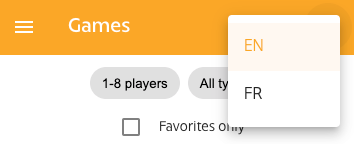
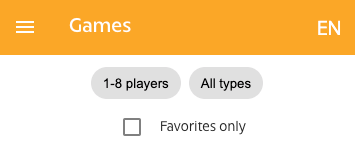
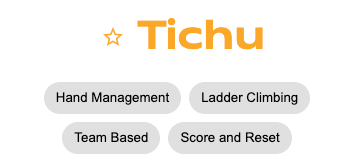
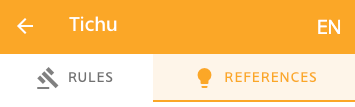
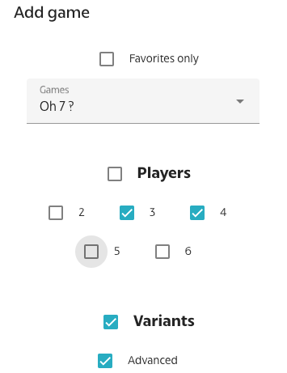
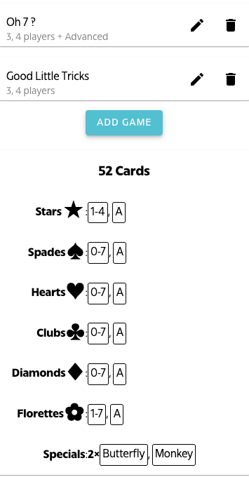

= Super-Set Deck WebApp Companion
:toc: preamble
:toclevels: 4
:icons: font

Ce site web est un companion au Super-Set Deck, un deck de 198 cartes.

Ce document décrit l'utilisation de ce site web et de son contenu.

== Navigation

Utilisez le menu en haut à gauche  pour naviguer parmi les pages et fonctionnalités de ce site web.

=== Langue

Vous pouvez toujours changer la langue du site web et de son contenu en cliquant sur les deux lettres représentant la langue en cours, ce qui ouvre le menu des langues.

CAUTION: Le nom d'un jeu peut varier d'une langue à une autre.

== Jeux

=== Liste

La liste des "Jeux" contient tous les jeux connus qui peuvent être joués avec le Super-Set Deck.

TIP: Cette liste est en constante évolution : de nouveaux jeux sont régulièrement ajoutés.

Vous pouvez filter cette liste :

* Par nombre de joueur·euse·s.
* Par type de jeu.
* Par favoris (qui sont individuels).

=== Règles

Après avoir cliqué sur un jeu, ses règles sont affichées.

IMPORTANT: Toutes les règles sur ce site ont été adaptées aux cartes spécifiques du Super-Set Deck !
           Ce ne sont donc pas les règles originales, qui peuvent souvent être trouvées sur https://boardgamegeek.com[Board-Game-Geek].

Notez que la page de règle d'un jeu vous permet de :

* Ajouter (ou retirer) un jeu dans votre liste de favoris en cliquant sur l'icône d'étoile à gauche du nom du jeu.
* Lister d'autres jeux du même type en cliquant sur les boutons des types.

=== Références en jeu

Il peut être difficile de se souvenir de toutes les particularités d'un jeu.
Pour vous aider (ainsi que vos co-joueur·euse·s), nous fournissons souvent des images de références qui devraient vous aider pendant votre partie.

Si nous fournissons une référence pour un jeu, une barre d'onglet apparaitra au-dessus des règles :

Dans cet onglet "Références", vous trouverez une ou plusieurs images qui devraient s'avérer utiles.

TIP: Toutes ses images sont au format carte de jeu (63mm x 88mm).
     Vous pouvez donc les imprimer en carte si vous souhaitez y accéder sans un écran.

Cliquer sur l'image l'ouvrira en plein-écran dans le visualiseur de référence.

==== Visualiseur

Lorsque vous êtes dans le mode Visualiseur de Référence, votre écran (téléphone, tablette ou ordinateur) *ne s'éteindra plus*.
Cela signifie que vous pouvez simplement ouvrir une image de référence dans le visualiseur et poser votre téléphone sur la table, visible de tous les joueur·euse·s.
L'image de référence restera visible pendant tout le jeu.

Notez que ces images sont sur fond noir précisément pour diminuer l'usage de la batterie pendant un affichage prolongé.

CAUTION: Faites attention à fermer le visualiseur une fois votre partie terminée, afin de permettre à votre téléphone de se reposer !

Dans le visualiseur, si plusieurs images de références sont disponibles pour ce jeu, vous pouvez :

* Glisser (swipe) entre les images.
* Cliquer sur une image pour la centrer.

=== Partage

Vous pouvez partager le lien vers la page d'un jeu en cliquant sur le  menu partage.

Vous pouvez toujours afficher un QR-Code qui pointe sur la page d'un jeu.

De plus, sur mobile, vous pouvez partager un lien par message.

== Packer

Le packer (dans le menu de gauche) est une fonctionnalité utile lorsque vous souhaitez emporter les cartes d'une combinaison de jeux spécifique, et ne pas emporter la totalité des cartes du Super-Set Deck.

Cliquez d'abord sur "Ajouter un jeu", pour ajouter un jeu spécifique.
Vous pouvez ici configurer le nombre de joueurs, ainsi que les variantes utilisées, pour lesquelles vous préparez (afin de n'emporter que les cartes exactement nécessaires).

Le packer vous affichera ensuite la liste des jeux que vous avez choisi, ainsi que les cartes nécessaires pour jouer tous ces jeux :

== Accès hors ligne

Ce site web peut être *installé sur votre téléphone ou tablette*, ce qui vous permettra d'*accéder à son contenu sans connexion*.

=== Android

Dans Chrome, cliquez sur le  menu en hait à droite et sélectionnez  "Installer l'application".

=== iOS

Dans Safari, cliquez sur le  menu partage en bas et sélectionnez  "Sur l'écran d'accueil".

== Contribuer

Vous pouvez accéder aux sources de ce site web et contribuer de nouvelles règles et/ou langues https://github.com/SalomonBrys/Super-Set-Deck-Games[ici].
